# Matching Short Tandem Repeats (STR) in Human DNA Using Python & The Command Line

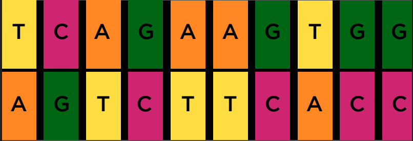
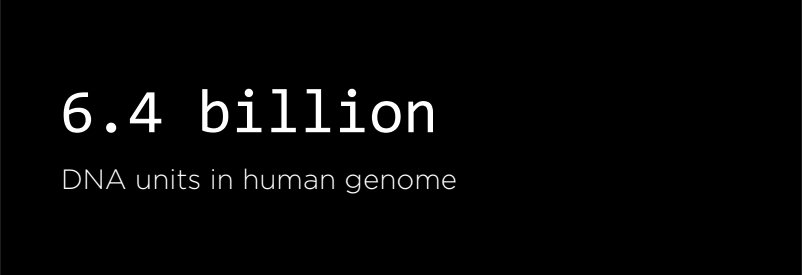
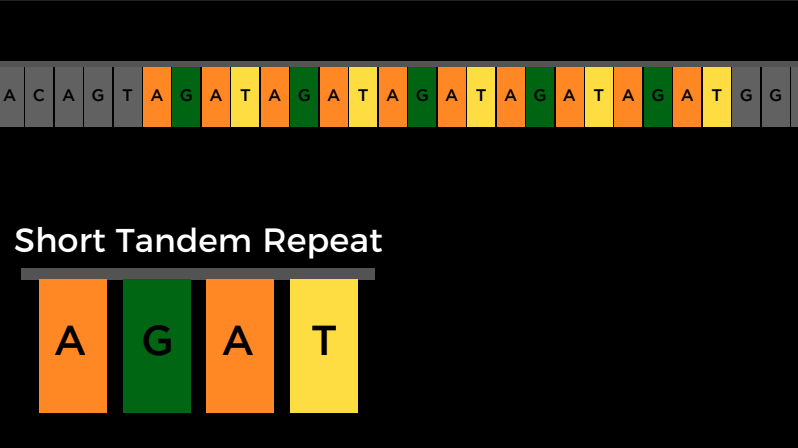

## I. Background
DNA is really just a sequence of molecules called nucleotides, arranged into a particular shape (a double helix). Each nucleotide of DNA contains one of four different bases: adenine (A), cytosine (C), guanine (G), or thymine (T). Every human cell has billions of these nucleotides arranged in sequence. Some portions of this sequence (i.e. genome) are the same, or at least very similar, across almost all humans, but other portions of the sequence have a higher genetic diversity and thus vary more across the population.

One place where DNA tends to have high genetic diversity is in Short Tandem Repeats (STRs). An STR is a short sequence of DNA bases that tends to repeat consecutively numerous times at specific locations inside of a person’s DNA. The number of times any particular STR repeats varies a lot among individuals. In the DNA samples below, for example, Alice has the STR AGAT repeated four times in her DNA, while Bob has the same STR repeated five times.

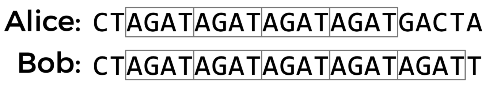

Using multiple STRs, rather than just one, can improve the accuracy of DNA profiling. If the probability that two people have the same number of repeats for a single STR is 5%, and the analyst looks at 10 different STRs, then the probability that two DNA samples match purely by chance is about 1 in 1 quadrillion (assuming all STRs are independent of each other). So if two DNA samples match in the number of repeats for each of the STRs, the analyst can be pretty confident they came from the same person. CODIS, The FBI’s DNA database, uses 20 different STRs as part of its DNA profiling process.

## II. System Prerequisites
* Python >= 3.7

## III. Data Source

 * [DNA_CS1](https://sigcse2020.sigcse.org/online/nifty.html#dnacs1)

## IV. The Target And Objective

The goal is to write a Python program that reads in a target DNA sequence file, stored in a txt file, and loops through the database files, in this case stored in flat files (CSV), and returns either a matching person's name or "NO MATCH".

Example from DNA Database from the US Department Of Commerce - National Institute of Standards And Technology
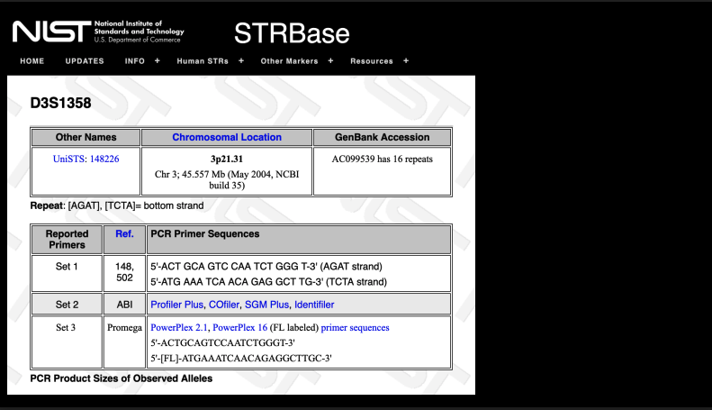
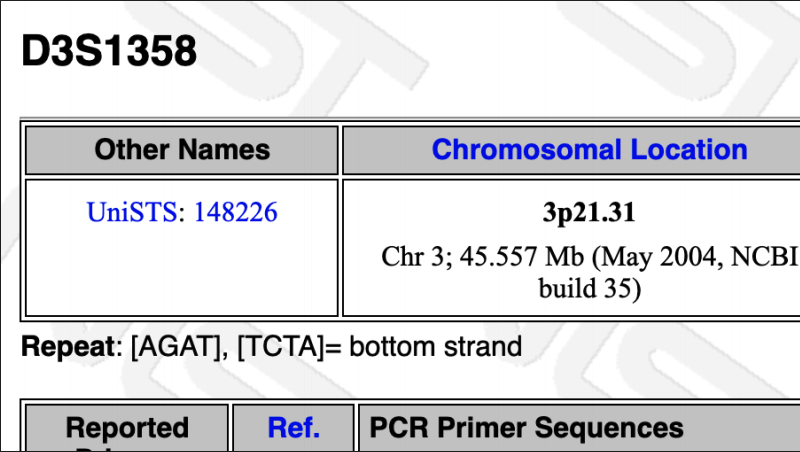
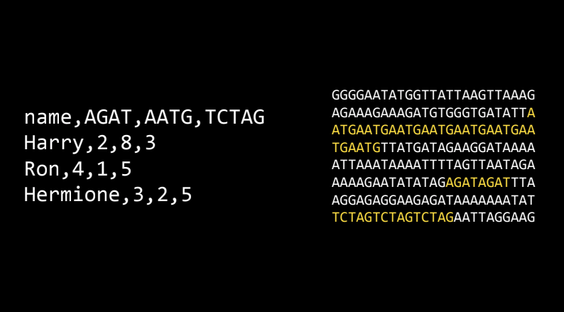

## V. The Algorithm & Test Cases Results

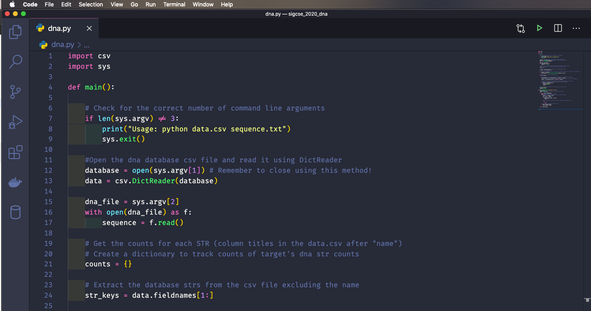
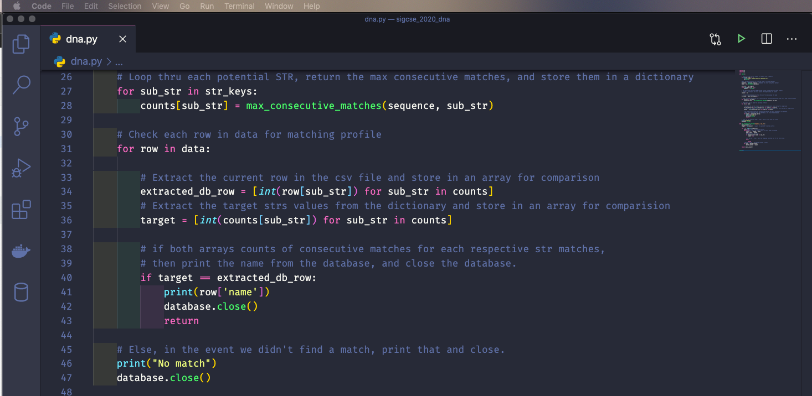
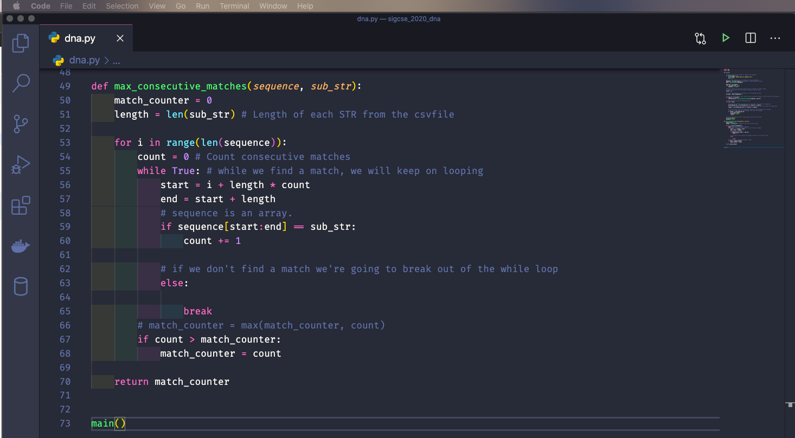

The test cases if you want to run them are in the "textcases.txt" file.

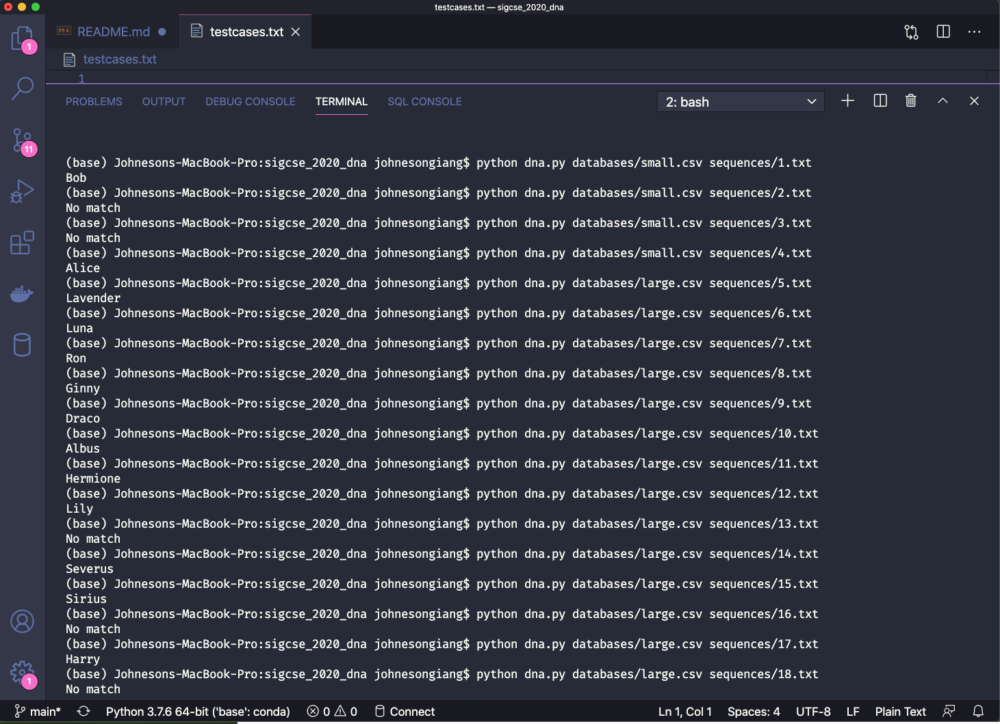

### Personal Note
* Hope you enjoyed it. Thank you for your time!

## Author

* **Johneson Giang** - Developer - [Github](https://github.com/jhustles)

## License

This project is licensed under the MIT License - see the [LICENSE.md](LICENSE.md) file for details

## Acknowledgments
* I definitely want to give a shout out to my dear teacher, mentor, and friend @CodingWithCorgis!
* Shout out to David J. Malan & Brian Yu